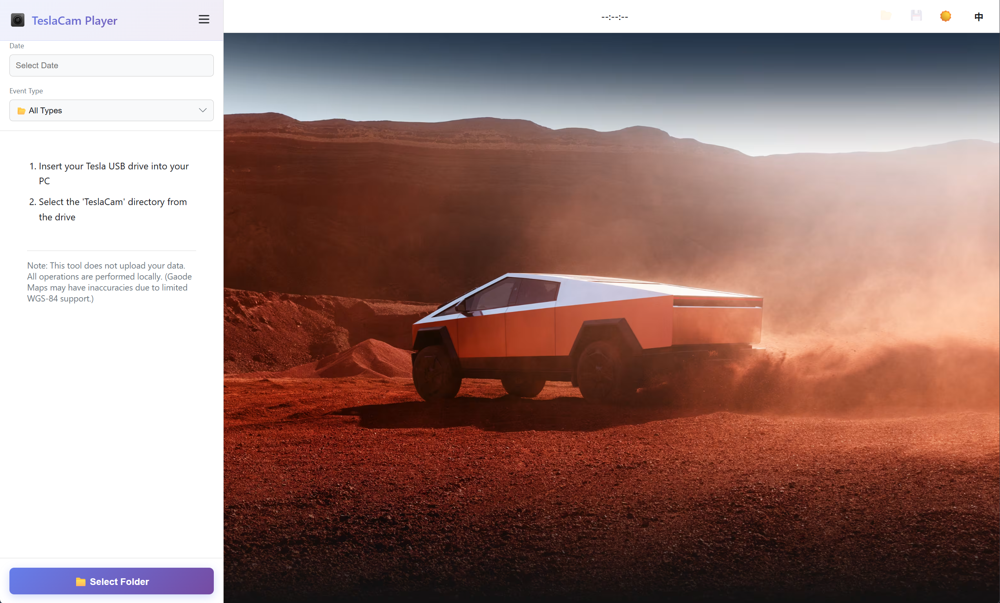
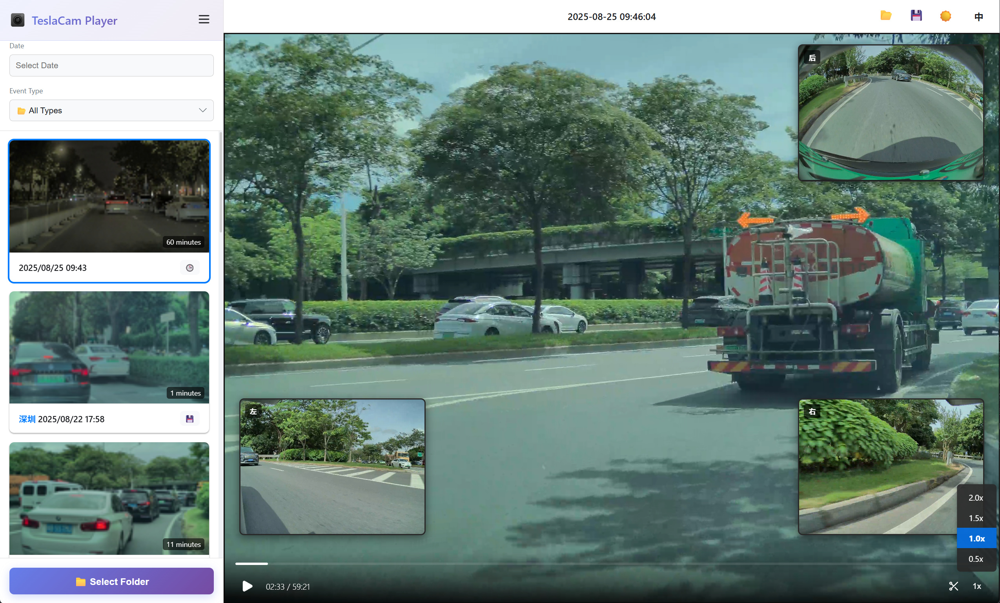
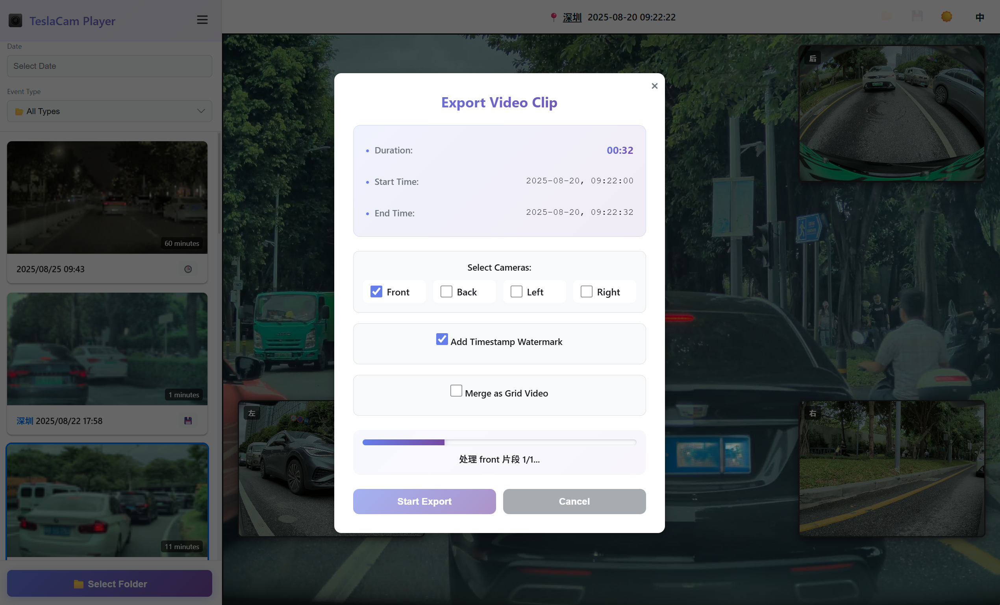

# TeslaCam Player

English | [简体中文](README_CN.md)

A modern, browser-based viewer for your TeslaCam footage. Play all four camera angles (Front, Back, Left, Right) simultaneously with a sleek and intuitive interface. Now available as a **desktop application**!



## ✨ Features

### 🎥 Video Playback
*   **Quad-Camera Sync Playback**: View footage from all four cameras at once, perfectly synchronized.
*   **Interactive PiP**: Click on any Picture-in-Picture view to make it the main video.
*   **Playback Speed Control**: Watch footage at 0.5x, 1.0x, 1.5x, or 2.0x speed.
*   **Real-Time Clock**: See the actual date and time of the recording as you play.
*   **Keyboard Shortcuts**: Control playback with your keyboard (`Space` for play/pause).

### ✂️ Advanced Video Editing
*   **Visual Clip Selection**: Drag blue handles on the progress bar to select precise start and end points.
*   **Multi-Segment Processing**: Automatically handles clips spanning multiple 1-minute video files.
*   **Confirm Button**: Separate clip selection from export action with a dedicated confirm button (✓) and visual feedback.
*   **Flexible Export Options**:
    - Select specific cameras to export (Front, Back, Left, Right, or any combination)
    - Add real-time timestamp watermarks showing exact recording time
    - Merge all four camera views into a single 2x2 grid video
    - Enhanced text visibility with double-sized fonts in grid mode (36px labels, 48px timestamps)
*   **Smart Processing**: All timestamps remain accurate across multi-segment clips with automatic time calculation.

### 🎨 Modern User Interface
*   **Dual-Theme Interface**: Switch between light and dark modes. Automatically detects your system's preference!
*   **Bilingual Support (EN/ZH)**: Complete interface translation in English and Chinese. Auto-detects browser language.
*   **Beautiful Export Modal**: Purple gradient theme with modern card design, smooth animations, and hover effects.
*   **Collapsible Sidebar**: Maximize video space by hiding the event list.
*   **Intuitive Icons**: Scissors icon (✂️) for clipping, checkmark (✓) for confirmation.
*   **Progress Visualization**: Gradient progress bars with glowing effects during export.

### 🔍 Smart Features
*   **Intuitive Filtering**: Easily filter recordings by date and event type (Recent, Saved, Sentry).
*   **Map Integration**: Click on the event's city to view the location on Gaode Map or Google Maps.
*   **Clip Download**: Download the currently playing video clip directly from the player.
*   **Zero-Time Support**: Correctly handles clips starting from the beginning (0:00).

### 🔒 Privacy & Performance
*   **100% Private**: All processing is done locally in your browser using Canvas API and MediaRecorder. Your files are never uploaded.
*   **Pure Vanilla JavaScript**: No frameworks, optimized for performance.
*   **Client-Side Rendering**: Real-time video processing with timestamp overlay directly in browser.

## 🚀 How to Use

### 🖥️ Desktop Application (Recommended)

Download the desktop application for your platform from the [Releases](https://github.com/DeaglePC/TeslaCamPlayer/releases) page:

| Platform | Download |
|----------|----------|
| Windows | `.exe` / `.msi` |
| macOS (Apple Silicon) | `.dmg` (aarch64) |
| macOS (Intel) | `.dmg` (x64) |
| Linux | `.deb` / `.AppImage` |

**Advantages of Desktop App:**
- No need to start a local server
- Native file system access
- Better performance
- Works offline

---

### 🌐 Online Version (Quickest Way)

You can directly use the online version without any installation:

**👉 [https://teslacam.dpc.cool/](https://teslacam.dpc.cool/)**

Simply visit the website and select your TeslaCam folder to start using it right away. All processing is done locally in your browser, ensuring your privacy.

---

### 💻 Local Deployment

Because of web browser security policies, you need to run this application from a local web server.

**1. Start the Local Server**

If you have Node.js installed, the easiest way is to use `npx`:

```bash
npx http-server -p 8188 src
```

Then, open your browser and go to `http://localhost:8188`.

**2. Deploy with Docker**

If you have Docker installed, you can easily run the application in a container.

**Option A: Using Docker Compose (Recommended)**

The easiest way is to use Docker Compose with the pre-built image:

1.  **Start the application:**
    ```bash
    docker compose up -d
    ```

2.  **Access the application:**
    Open your browser and go to `http://localhost:8188`.

3.  **Stop the application:**
    ```bash
    docker compose down
    ```

4.  **View logs:**
    ```bash
    docker compose logs -f
    ```

5.  **Update to latest version:**
    ```bash
    docker compose pull
    docker compose up -d
    ```

**Option B: Using Docker CLI**

1.  **Pull and run the pre-built image:**
    ```bash
    docker run -d -p 8188:80 --name teslacamplayer dupengcheng66666/teslacamplayer:latest
    ```

2.  **Or build your own image:**
    ```bash
    docker build -t teslacam-player .
    docker run -d -p 8188:80 teslacam-player
    ```

3.  **Access the application:**
    Open your browser and go to `http://localhost:8188`.

**3. Select Your TeslaCam Folder**

1.  Click the "📁 Select Folder" button.
2.  In the file selection dialog, navigate to and select the root `TeslaCam` folder from your USB drive.

**4. Browse and Play**



*   Your recordings will appear in the sidebar, sorted by date.
*   Use the filters to find specific events.
*   Click on any event to start playing.
*   Click on a city name (if available) to open the location on Gaode Map or Google Maps.
*   When paused, click the 💾 icon in the header to download the current video file.

**5. Clip and Export Videos**



1.  Click the **✂️ (scissors)** icon in the video controls to enter clip mode.
2.  **Drag the blue handles** on the progress bar to select the start and end points of your desired clip.
3.  Click the **✓ (checkmark)** icon to confirm your selection and open the export dialog.


4.  **Configure export options**:
    - **Select Cameras**: Choose which camera angles to export (Front, Back, Left, Right, or any combination)
    - **Add Timestamp Watermark**: Overlay real-time timestamp showing the exact recording time
    - **Merge as Grid Video**: Combine all selected cameras into a single 2x2 grid view with enhanced text visibility
5.  Click **"Start Export"** to process and download your clip(s).

**Key Features:**
- Automatically handles clips spanning multiple 1-minute video segments
- Maintains accurate timestamps across all segments
- Grid videos feature double-sized text (36px camera labels, 48px timestamps) for better readability
- All processing is done locally in your browser using Canvas API and MediaRecorder
- Exported videos are in WebM format with H.264 codec

*Note: For clips longer than 1 minute, the application automatically processes all required video segments and concatenates them seamlessly.*

## ⌨️ Keyboard Shortcuts

*   **`Spacebar`**: Play / Pause the video.

## 🔒 Privacy First

This tool is built with privacy as a top priority. **All file processing happens directly in your browser.** Your videos and data are never uploaded to any server. It's completely private and secure.

## 🛠️ Tech Stack

*   **HTML5, CSS3, JavaScript (ES6+)**
*   No frameworks, just pure vanilla JS for performance.
*   File System Access API for local file handling.
*   **Tauri** for desktop application (Rust backend + WebView).

## 📄 License

MIT License

